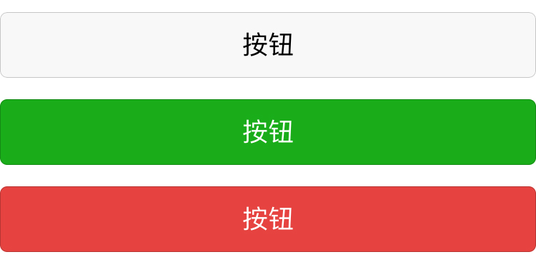
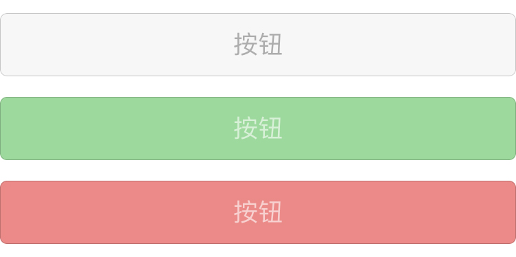
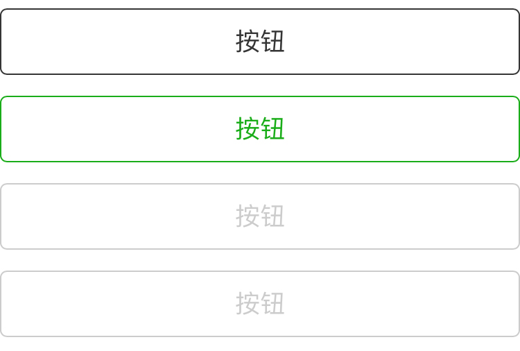
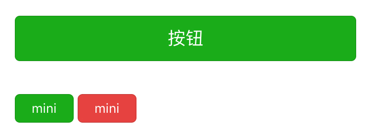

## 按钮

按钮样式可以用于 `a` 或 `button` 标签。

按钮常用的样式有 `weui-btn_default`、`weui-btn_primary` 和 `weui-btn_warn` 三种，分别是白色、绿色和红色，还有一种镂空的样式 `weui-btn_plain-xxx`，其中 `xxx` 可以是 `default` 或 `primary`。上述每种按钮都有置灰的禁用状态 `weui-btn_disabled`。

使用上述任意一种样式时都不要忘了加上 `weui-btn` 类。

```html
<!-- 白色按钮 -->
<a href="#" class="weui-btn weui-btn_default">按钮</a>
<!-- 绿色按钮 -->
<a href="#" class="weui-btn weui-btn_primary">按钮</a>
<!-- 红色按钮 -->
<a href="#" class="weui-btn weui-btn_warn">按钮</a>
<!-- 白色禁用按钮 -->
<a href="#" class="weui-btn weui-btn_disabled weui-btn_default">按钮</a>
<!-- 绿色禁用按钮 -->
<a href="#" class="weui-btn weui-btn_disabled weui-btn_primary">按钮</a>
<!-- 红色禁用 -->
<a href="#" class="weui-btn weui-btn_disabled weui-btn_warn">按钮</a>
<!-- 白色镂空 -->
<a href="#" class="weui-btn weui-btn_plain-default">按钮</a>
<!-- 绿色镂空 -->
<a href="#" class="weui-btn weui-btn_plain-primary">按钮</a>
<!-- 白色镂空禁用 -->
<a href="#" class="weui-btn weui-btn_plain-default weui-btn_plain-disabled">按钮</a>
<!-- 绿色镂空禁用 -->
<a href="#" class="weui-btn weui-btn_plain-primary weui-btn_plain-disabled">按钮</a>
```







按钮默认是 100% 的宽度，所以在页面上左右两侧是没有空隙的，如果想要两侧留有空隙，在按钮的父级元素添加 `weui-btn-area` 类即可。

```html
<!-- 按钮两侧留有空隙 -->
<div class="weui-btn-area">
    <a href="#" class="weui-btn weui-btn_primary">按钮</a>
</div>
```

除以上这些按钮样式，还有一种小尺寸的按钮，宽度为自适应，在上面的任意样式按钮添加 `weui-btn_mini` 类即可。

```html
<!-- mini 按钮 -->
<a href="#" class="weui-btn weui-btn_mini weui-btn_primary">mini 按钮</a>
```

