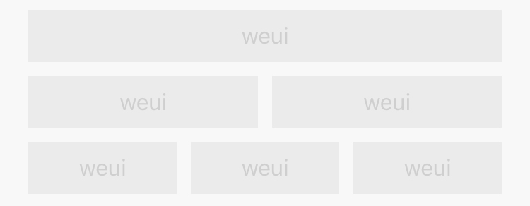

## Flex 布局

Flex 布局是一种简便的、响应式的页面布局方式，可以用较简单的代码来实现较复杂的布局，并且目前大多数浏览器都已支持 Flex 布局。更多相关知识点请自行搜索学习。

WeUI 提供了一种类似于栅格化的 Flex 布局方式，用法也比较简单。

其中 `weui-flex` 为一个 Flex 容器，`weui-flex__item` 为 Flex 容器内的项目，每个项目默认占满容器内可用的宽度。如果一个容器内有一个项目，则这一个项目占满所有宽度；如果一个容器内有两个项目，则两个项目平分所有的宽度；如果一个容器内有三个项目，则三个项目三等分所有的宽度；以此类推。

```html
<div class="weui-flex">
    <div class="weui-flex__item"></div>
</div>
<div class="weui-flex">
    <div class="weui-flex__item"></div>
    <div class="weui-flex__item"></div>
</div>
<div class="weui-flex">
    <div class="weui-flex__item"></div>
    <div class="weui-flex__item"></div>
    <div class="weui-flex__item"></div>
</div>
```

