## 表单

和列表一样，每一组表单的样式类为 `weui-cells`，然后再添加相应类型的样式类，比如单选对应 `weui-cells_radio`，多选对应 `weui-cells_checkbox`，表单对应 `weui-cells_form` 等；列表内每一个条目的样式类为 `weui-cell`，再添加相应类型的样式类；一组表单内可有多个条目。

表单校验相关功能可使用 [weui.js（点击查看相关文档）](https://github.com/weui/weui.js/blob/master/docs/component/form.md)

### 单选 / radio

```html
<!-- 单选 -->
<div class="weui-cells weui-cells_radio">
    <label class="weui-cell weui-check__label" for="x11">
        <div class="weui-cell__bd">
            <p>单选项文字</p>
        </div>
        <div class="weui-cell__ft">
            <input type="radio" name="radio1" class="weui-check" id="x11">
            <span class="weui-icon-checked"></span>
        </div>
    </label>
    <label class="weui-cell weui-check__label" for="x12">
        <div class="weui-cell__bd">
            <p>单选项文字</p>
        </div>
        <div class="weui-cell__ft">
            <input type="radio" name="radio1" class="weui-check" id="x12" checked="checked">
            <span class="weui-icon-checked"></span>
        </div>
    </label>
    <a href="#" class="weui-cell weui-cell_link">
        <div class="weui-cell__bd">添加更多</div>
    </a>
</div>
```

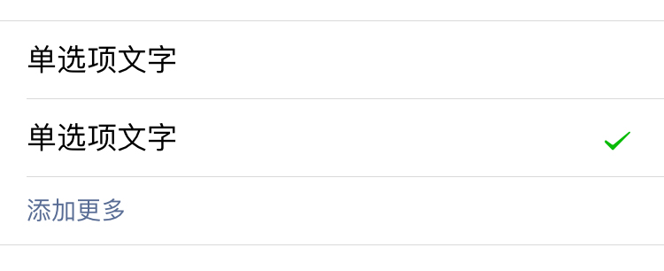

### 多选 / checkbox

```html
<!-- 多选 -->
<div class="weui-cells weui-cells_checkbox">
    <label class="weui-cell weui-check__label" for="s11">
        <div class="weui-cell__hd">
            <input type="checkbox" class="weui-check" name="checkbox1" id="s11" checked="checked">
            <i class="weui-icon-checked"></i>
        </div>
        <div class="weui-cell__bd">
            <p>多选项文字</p>
        </div>
    </label>
    <label class="weui-cell weui-check__label" for="s12">
        <div class="weui-cell__hd">
            <input type="checkbox" name="checkbox1" class="weui-check" id="s12">
            <i class="weui-icon-checked"></i>
        </div>
        <div class="weui-cell__bd">
            <p>多选项文字</p>
        </div>
    </label>
    <a href="#" class="weui-cell weui-cell_link">
        <div class="weui-cell__bd">添加更多</div>
    </a>
</div>
```

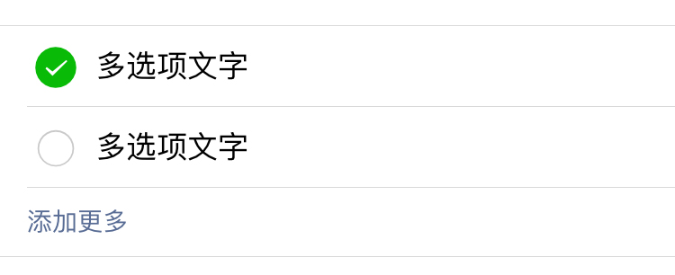

### 输入框 / input

使用输入框，注意每一组表单除了 `weui-cells` 类，还需要 `weui-cells_form` 类。

```html
<!-- 输入框 -->
<div class="weui-cells weui-cells_form">
    <div class="weui-cell">
        <div class="weui-cell__hd"><label class="weui-label">标题</label></div>
        <div class="weui-cell__bd">
            <input class="weui-input" type="text" placeholder="占位符">
        </div>
    </div>
</div>
```

注意 input 的 type 属性值可以为 text、number、email、date、time 等，属性值为 date、time 时可用来输入日期或时间，WeUI 本身本没有日期选择器和时间选择器，更多关于 input 的 type 属性值可参考[这里](https://developer.mozilla.org/zh-CN/docs/Web/HTML/Element/Input)。

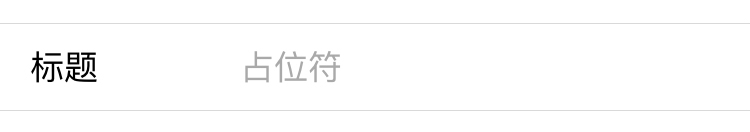

### 带按钮的输入框 / input

带按钮的输入框的使用场景可以为用户输入手机号获取验证码等。

注意不要忘记 `weui-cell_vcode` 类

```html
<!-- 带按钮的输入框 -->
<div class="weui-cells weui-cells_form">
    <div class="weui-cell weui-cell_vcode">
        <div class="weui-cell__hd">
            <label class="weui-label">手机号</label>
        </div>
        <div class="weui-cell__bd">
            <input class="weui-input" type="tel" placeholder="请输入手机号">
        </div>
        <div class="weui-cell__ft">
            <a href="#" class="weui-vcode-btn">获取验证码</a>
        </div>
    </div>
</div>
```

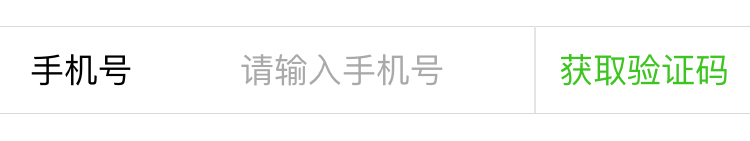

### 带图片的输入框 / input

带图片的输入框的使用场景可以为验证码输入。

```html
<!-- 带图片的输入框 -->
<div class="weui-cells weui-cells_form">
    <div class="weui-cell weui-cell_vcode">
        <div class="weui-cell__hd">
            <label class="weui-label">验证码</label>
        </div>
        <div class="weui-cell__bd">
            <input class="weui-input" type="number" placeholder="请输入验证码">
        </div>
        <div class="weui-cell__ft">
            
        </div>
    </div>
</div>
```

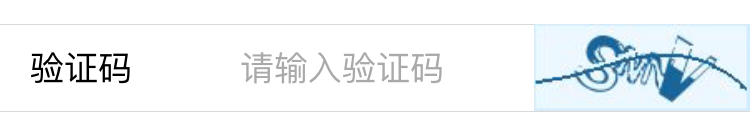

### 带选择的输入框 / input & select

```html
<!-- 带选择的输入框 -->
<div class="weui-cells">
    <div class="weui-cell weui-cell_select weui-cell_select-before">
        <div class="weui-cell__hd">
            <select class="weui-select" name="">
                <option value="1">+86</option>
                <option value="2">+80</option>
                <option value="3">+84</option>
                <option value="4">+87</option>
            </select>
        </div>
        <div class="weui-cell__bd">
            <input class="weui-input" type="number" placeholder="请输入号码">
        </div>
    </div>
</div>
```

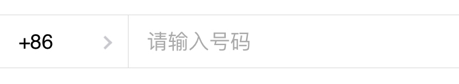

### 警告样式的输入框 / input

警告样式用于表单验证错误时提醒用户，在出错的表单元素上添加 `weui-cell_warn` 类即可，此时字体会变为红色，输入框后也会出现警告样式图标。

```html
<!-- 警告样式的输入框 -->
<div class="weui-cells weui-cells_form">
    <div class="weui-cell weui-cell_warn">
        <div class="weui-cell__hd">
            <label for="" class="weui-label">卡号</label>
        </div>
        <div class="weui-cell__bd">
            <input class="weui-input" type="number" placeholder="请输入卡号">
        </div>
        <div class="weui-cell__ft">
            <i class="weui-icon-warn"></i>
        </div>
    </div>
</div>
```

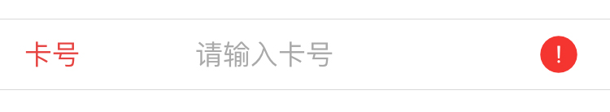

### 文本框 / textarea

文本框用于输入篇幅较长的文本。

```html
<div class="weui-cells weui-cells_form">
    <div class="weui-cell">
        <div class="weui-cell__bd">
            <textarea class="weui-textarea" placeholder="请输入文本" rows="3"></textarea>
            <div class="weui-textarea-counter"><span>0</span>/200</div>
        </div>
    </div>
</div>
```

注意右下角的文字计数器功能需自行实现，WeUI 仅提供样式。

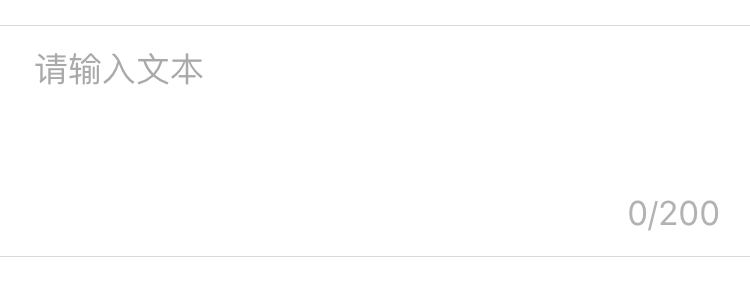

### 开关 / radio

```html
<!-- 开关 -->
<div class="weui-cells weui-cells_form">
    <div class="weui-cell weui-cell_switch">
        <div class="weui-cell__bd">标题文字</div>
        <div class="weui-cell__ft">
            <input class="weui-switch" type="checkbox">
        </div>
    </div>
</div>
```

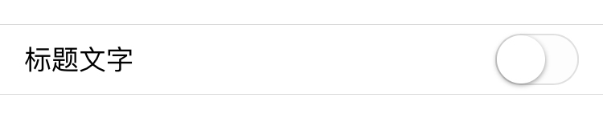

### 选择 / select

选择有带标题和不带标题两种样式。

```html
<!-- 选择 -->
<div class="weui-cells">
    <!-- 不带标题 -->
    <div class="weui-cell weui-cell_select">
        <div class="weui-cell__bd">
            <select class="weui-select" name="">
                <option selected="" value="1">微信号</option>
                <option value="2">QQ号</option>
                <option value="3">Email</option>
            </select>
        </div>
    </div>
    <!-- 带标题 -->
    <div class="weui-cell weui-cell_select weui-cell_select-after">
        <div class="weui-cell__hd">
            <label for="" class="weui-label">国家/地区</label>
        </div>
        <div class="weui-cell__bd">
            <select class="weui-select" name="">
                <option value="1">中国</option>
                <option value="2">美国</option>
                <option value="3">英国</option>
            </select>
        </div>
    </div>
</div>
```

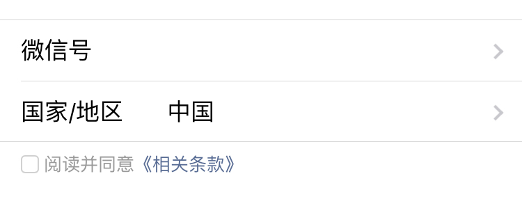

### 底部文字和勾选框  / checkbox

使用场景为表单填写完成后用户同意服务条款的勾选框，其位于 `weui-cells` 之外，与列表中的底部说明文字 `weui-cells__tips` 位置相同。

```html
<label for="" class="weui-agree">
    <input type="checkbox" class="weui-agree__checkbox">
    <span class="weui-agree__text">
        阅读并同意<a href="#">《相关条款》</a>
    </span>
</label>
```

样式见上图

### 图片上传

WeUI 仅提供样式，具体功能请根据自己的业务需求自行实现。

```html
<!-- 图片上传 -->
<div class="weui-cells weui-cells_form">
    <div class="weui-cell">
        <div class="weui-cell__bd">
            <div class="weui-uploader">
                <div class="weui-uploader__hd">
                    <!-- 标题 -->
                    <p class="weui-uploader__title">图片上传</p>
                    <!-- 计数器样式 -->
                    <div class="weui-uploader__info">0/2</div>
                </div>
                <div class="weui-uploader__bd">
                    <ul class="weui-uploader__files">
                        <!-- 上传成功后的样式 -->
                        <li class="weui-uploader__file" style="background-image:url(./images/pic_160.png)"></li>
                        <!-- 上传失败后的样式 -->
                        <li class="weui-uploader__file weui-uploader__file_status" style="background-image:url(./images/pic_160.png)">
                            <div class="weui-uploader__file-content">
                                <i class="weui-icon-warn"></i>
                            </div>
                        </li>
                        <!-- 正在上传的样式 -->
                        <li class="weui-uploader__file weui-uploader__file_status" style="background-image:url(./images/pic_160.png)">
                            <div class="weui-uploader__file-content">50%</div>
                        </li>
                    </ul>
                    <!-- 添加图片按钮（加号） -->
                    <div class="weui-uploader__input-box">
                        <input class="weui-uploader__input" type="file" accept="image/*" multiple="">
                    </div>
                </div>
            </div>
        </div>
    </div>
</div>
```

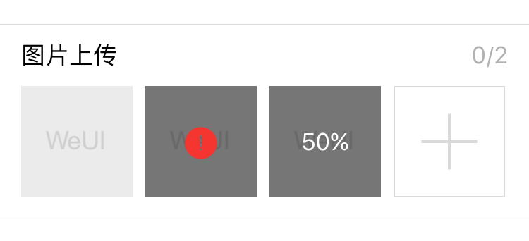