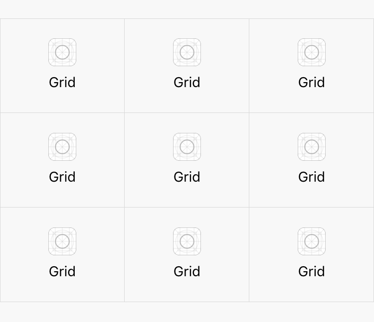

## 九宫格

九宫格是移动端常见的一种布局，常见的有微信钱包。

九宫格布局最外层是一个样式类为 `weui-grids`，然后每一个宫格均为 `weui-grid`。当然，九宫格不一定非要是九个，多少个都行，建议至少三个。

```html
<!-- 九宫格 -->
<div class="weui-grids">
    <!-- 第一个宫格 -->
    <a href="#" class="weui-grid">
        <!-- 图标 -->
        <div class="weui-grid__icon">
            
        </div>
        <!-- 标签文字 -->
        <p class="weui-grid__label">标签文字</p>
    </a>
    <!-- 第二个宫格 -->
    <a href="#" class="weui-grid">
        <!-- 图标 -->
        <div class="weui-grid__icon">
            
        </div>
        <!-- 标签文字 -->
        <p class="weui-grid__label">标签文字</p>
    </a>
</div>
```

