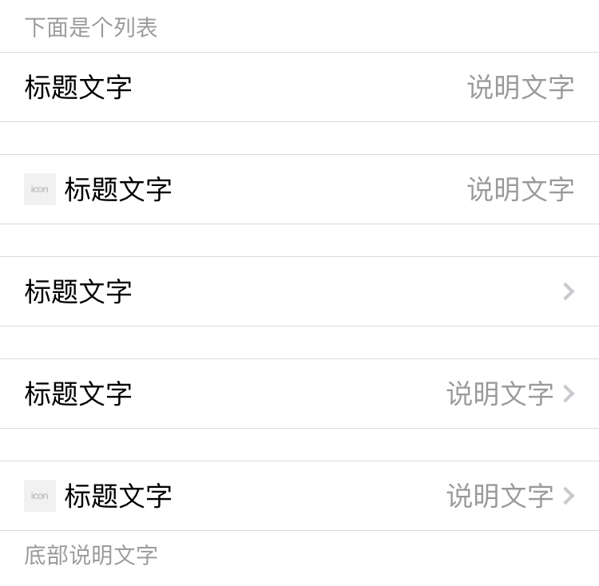

## 列表

每一组列表顶部和底部都可以添加一些说明文字，样式类分别是 `weui-cells__title` 和 `weui-cells__tips`。

每一组列表的样式类为 `weui-cells`；列表的每一条目样式类为 `weui-cell`；每一组列表内可包含多个条目。下面的示例代码中仅有一个条目，顶部和底部的说明文字在 `weui-cells` 外。

```html
<!-- 列表组顶部说明文字 -->
<div class="weui-cells__title">下面是个列表</div>
<!-- 带说明的列表 -->
<div class="weui-cells">
    <div class="weui-cell">
        <div class="weui-cell__bd">
            <p>标题文字</p>
        </div>
        <div class="weui-cell__ft">说明文字</div>
    </div>
</div>
<!-- 带图标和说明的列表项 -->
<div class="weui-cells">
    <div class="weui-cell">
        <div class="weui-cell__hd"></div>
        <div class="weui-cell__bd">
            <p>标题文字</p>
        </div>
        <div class="weui-cell__ft">说明文字</div>
    </div>
</div>
<!-- 带跳转的列表 -->
<div class="weui-cells">
    <a href="#" class="weui-cell weui-cell_access">
        <div class="weui-cell__bd">
            <p>标题文字</p>
        </div>
        <div class="weui-cell__ft"></div>
    </a>
</div>
<!-- 带说明、跳转的列表项 -->
<div class="weui-cells">
    <a href="#" class="weui-cell weui-cell_access">
        <div class="weui-cell__bd">
            <p>标题文字</p>
        </div>
        <div class="weui-cell__ft">说明文字</div>
    </a>
</div>
<!-- 带图标、说明、跳转的列表项 -->
<div class="weui-cells">
    <a href="#" class="weui-cell weui-cell_access">
        <div class="weui-cell__hd"></div>
        <div class="weui-cell__bd">
            <p>标题文字</p>
        </div>
        <div class="weui-cell__ft">说明文字</div>
    </a>
</div>
<!-- 列表组底部说明文字 -->
<div class="weui-cells__tips">底部说明文字</div>
```

