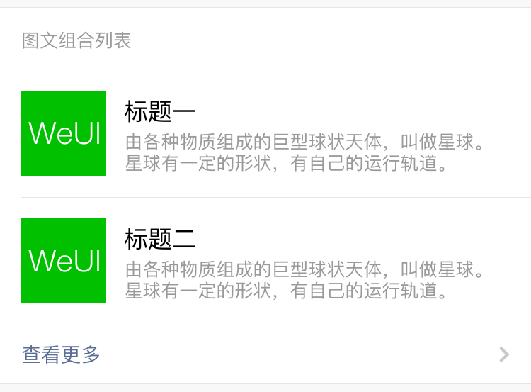
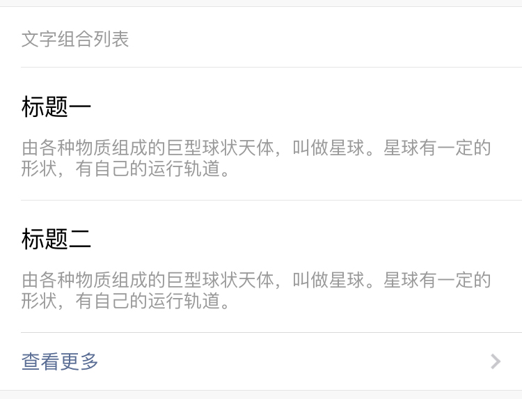
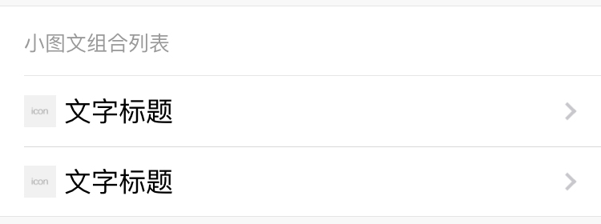
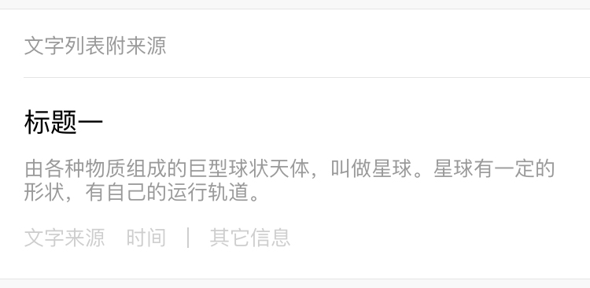

## 面板

面板用于显示组合式的列表信息，由 head、body 和 foot 三部分组成，其中 head 和 foot 是可选的。WeUI 提供了多种面板样式，可根据业务选择不同的样式。

foot 部分默认支持“查看更多”样式，不过需要在 `weui-panel` 添加一个 `weui-panel_access` 类。

> `weui-media-box__desc` 内的文字默认最多显示两行，超出部分会自动隐藏掉

### 图文组合列表

```html
<!-- 图文组合列表 -->
<div class="weui-panel weui-panel_access">
    <!-- head 部分 -->
    <div class="weui-panel__hd">图文组合列表</div>
    <!-- body 部分 -->
    <div class="weui-panel__bd">
        <!-- 一个列表条目 -->
        <a href="#" class="weui-media-box weui-media-box_appmsg">
            <div class="weui-media-box__hd">
                
            </div>
            <div class="weui-media-box__bd">
                <h4 class="weui-media-box__title">标题</h4>
                <p class="weui-media-box__desc">内容</p>
            </div>
        </a>
    </div>
    <!-- foot 部分 -->
    <div class="weui-panel__ft">
        <a href="#" class="weui-cell weui-cell_access weui-cell_link">
            <div class="weui-cell__bd">查看更多</div>
            <span class="weui-cell__ft"></span>
        </a>
    </div>
</div>
```



### 文字组合列表

```html
<!-- 文字组合列表 -->
<div class="weui-panel weui-panel_access">
    <!-- head 部分 -->
    <div class="weui-panel__hd">文字组合列表</div>
    <!-- body 部分 -->
    <div class="weui-panel__bd">
        <!-- 一个列表条目 -->
        <div href="#" class="weui-media-box weui-media-box_text">
            <h4 class="weui-media-box__title">标题</h4>
            <p class="weui-media-box__desc">内容</p>
        </div>
    </div>
    <!-- foot 部分 -->
    <div class="weui-panel__ft">
        <a href="#" class="weui-cell weui-cell_access weui-cell_link">
            <div class="weui-cell__bd">查看更多</div>
            <span class="weui-cell__ft"></span>
        </a>
    </div>
</div>
```



### 小图文组合列表

```html
<!-- 小图文组合列表 -->
<div class="weui-panel">
    <!-- head 部分 -->
    <div class="weui-panel__hd">小图文组合列表</div>
    <!-- body 部分 -->
    <div class="weui-panel__bd">
        <div href="#" class="weui-media-box weui-media-box_small-appmsg">
            <div class="weui-cells">
                <!-- 一个列表条目 -->
                <a href="#" class="weui-cell weui-cell_access">
                    <div class="weui-cell__hd">
                        
                    </div>
                    <div class="weui-cell__bd weui-cell_primary">
                        <p>文字标题</p>
                    </div>
                    <span class="weui-cell__ft"></span>
                </a>
            </div>
        </div>
    </div>
</div>
```



### 文字列表附来源

```html
<!-- 文字列表附来源 -->
<div class="weui-panel">
    <!-- head 部分 -->
    <div class="weui-panel__hd">文字列表附来源</div>
    <!-- body 部分 -->
    <div class="weui-panel__bd">
        <!-- 一个列表条目 -->
        <div href="#" class="weui-media-box weui-media-box_text">
            <h4 class="weui-media-box__title">标题</h4>
            <p class="weui-media-box__desc">内容</p>
            <ul class="weui-media-box__info">
                <li class="weui-media-box__info__meta">文字来源</li>
                <li class="weui-media-box__info__meta">时间</li>
                <li class="weui-media-box__info__meta weui-media-box__info__meta_extra">其它信息</li>
            </ul>
        </div>
    </div>
</div>
```

