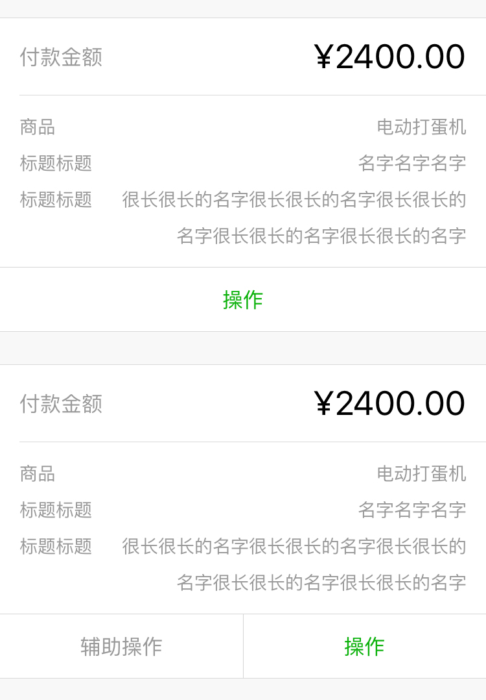

## 表单预览

表单预览可用于显示账单等。

foot 部分的操作按钮可以为一个，也可以为多个，样式有 `weui-form-preview__btn_default` 和 `weui-form-preview__btn_primary` 两种。

```html
<!-- 表单预览 -->
<div class="weui-form-preview">
    <!-- head 部分 -->
    <div class="weui-form-preview__hd">
        <div class="weui-form-preview__item">
            <label class="weui-form-preview__label">付款金额</label>
            <em class="weui-form-preview__value">¥2400.00</em>
        </div>
    </div>
    <!-- body 部分 -->
    <div class="weui-form-preview__bd">
        <div class="weui-form-preview__item">
            <label class="weui-form-preview__label">商品</label>
            <span class="weui-form-preview__value">电动打蛋机</span>
        </div>
        <div class="weui-form-preview__item">
            <label class="weui-form-preview__label">标题标题</label>
            <span class="weui-form-preview__value">名字名字名字</span>
        </div>
        <div class="weui-form-preview__item">
            <label class="weui-form-preview__label">标题标题</label>
            <span class="weui-form-preview__value">很长很长的名字很长很长的名字</span>
        </div>
    </div>
    <!-- foot 部分 -->
    <div class="weui-form-preview__ft">
        <a href="#" class="weui-form-preview__btn weui-form-preview__btn_default">辅助操作</a>
        <a href="#" class="weui-form-preview__btn weui-form-preview__btn_primary">操作</a>
    </div>
</div>
```

