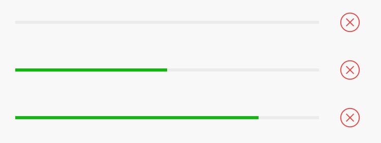

## 进度条

进度条用于上传、下载等需要显示进度的场景，用户可随时中断此操作。

```html
<!-- 进度条 -->
<div class="weui-progress">
    <div class="weui-progress__bar">
        <div class="weui-progress__inner-bar" style="width: 80%;"></div>
    </div>
    <!-- 取消按钮 -->
    <a href="#" class="weui-progress__opr">
        <i class="weui-icon-cancel"></i>
    </a>
</div>
```

`weui-progress__inner-bar` 的 `width` 属性表示进度条的百分比，取消按钮可选。

