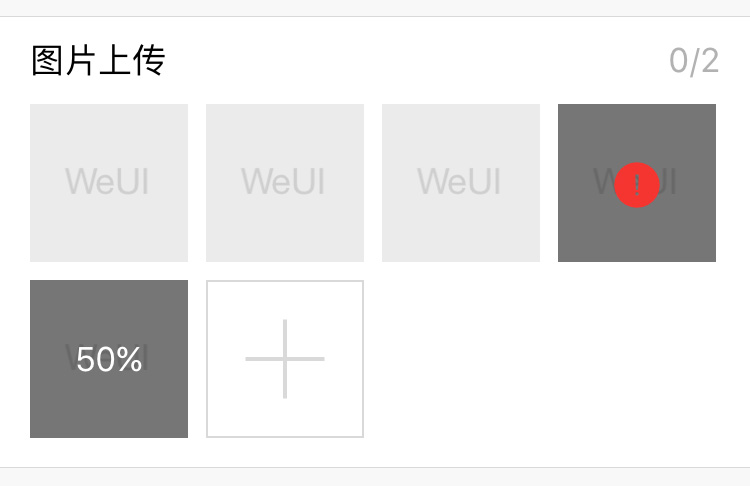

## 上传组件

上传组件主要用于图片上传，一般需要配合[相册组件](gallery.md)使用，WeUI 中仅包含样式，上传所需的逻辑操作需自行实现或配合 [weui.js（点击查看相关文档）](https://github.com/weui/weui.js/blob/master/docs/component/uploader.md) 实现。

```html
<div class="weui-uploader">
    <div class="weui-uploader__hd">
        <p class="weui-uploader__title">图片上传</p>
        <div class="weui-uploader__info">0/2</div>
    </div>
    <div class="weui-uploader__bd">
        <!-- 图片列表 -->
        <ul class="weui-uploader__files">
            <!-- 已上传图片 -->
            <li class="weui-uploader__file" style="background-images:url(images_url/images.png)"></li>
            <!-- 上传状态，如上传失败 -->
            <li class="weui-uploader__file weui-uploader__file_status" style="background-images:url(images_url/images.png)">
                <div class="weui-uploader__file-content">
                    <!-- 此处图标可根据需求自行选择 -->
                    <i class="weui-icon-warn"></i>
                </div>
            </li>
            <!-- 上传进度 -->
            <li class="weui-uploader__file weui-uploader__file_status" style="background-images:url(images_url/images.png)">
                <!-- 上传百分比 -->
                <div class="weui-uploader__file-content">50%</div>
            </li>
        </ul>
        <!-- 上传按钮 -->
        <div class="weui-uploader__input-box">
            <input type="file" class="weui-uploader__input" accept="image/*" multiple>
        </div>
    </div>
</div>
```

